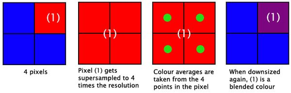
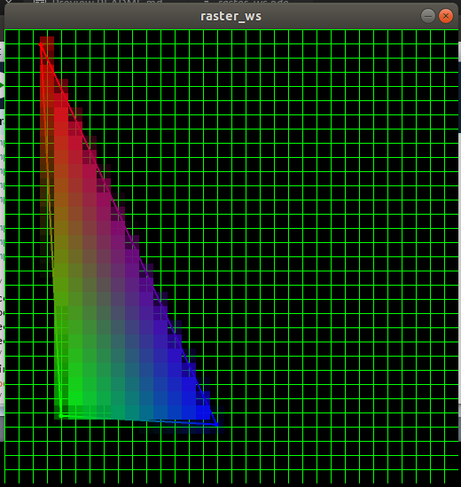
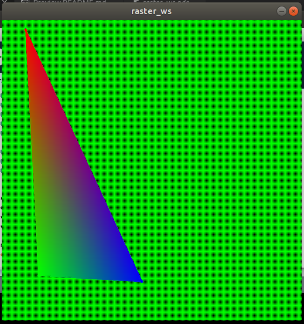

# Taller raster

## Propósito

Comprender algunos aspectos fundamentales del paradigma de rasterización.

## Tareas

Emplee coordenadas baricéntricas para:

1. Rasterizar un triángulo.
2. Sombrear su superficie a partir de los colores de sus vértices.
3. Implementar un [algoritmo de anti-aliasing](https://www.scratchapixel.com/lessons/3d-basic-rendering/rasterization-practical-implementation/rasterization-practical-implementation) para sus aristas.

Referencias:

* [The barycentric conspiracy](https://fgiesen.wordpress.com/2013/02/06/the-barycentric-conspirac/)
* [Rasterization stage](https://www.scratchapixel.com/lessons/3d-basic-rendering/rasterization-practical-implementation/rasterization-stage)

Implemente la función ```triangleRaster()``` del sketch adjunto para tal efecto, requiere la librería [nub](https://github.com/visualcomputing/nub/releases) (versión >= 0.2).

## Integrantes

Complete la tabla:

| Integrante | github nick |
|------------|-------------|
|Juan Sebastian Chaves Ramirez|jschavesr|
|Laura Beatriz Santos Guerrero|lsfinite|
|Juan Camilo Rodríguez Puentes|Juankmilo97|
	
## Discusión

Los objetivos del taller propuesto fueron:

1. Rasterizar un triángulo.
2. Sombrear su superficie a partir de los colores de sus vértices.
3. Implementar un [algoritmo de anti-aliasing](https://www.scratchapixel.com/lessons/3d-basic-rendering/rasterization-practical-implementation/rasterization-practical-implementation) para sus aristas.


Algoritmo de Anti-Aliasing :



Se busca que los píxeles individuales dentro de un polígono se dividan en múltiples muestras de cobertura, con la finalidad de analizar el color de los píxeles que rodean cada una de estas muestras,y producir un promedio de las mismas, que determinen el color general del píxel original.



_Triángulo SIN anti-aliasing_



_Triángulo CON anti-aliasing_

### Referencias

[Diapositivas de Steve Marschner sobre Rasterization](https://github.com/GraphicHacking/VC-Workshops/blob/master/workshop3/13rasterization.pdf) de la Univerisad de Cornell { *CS4620 Fall 2014 • Lecture 13* }

[Diapositivas sobre Rasterization](https://github.com/GraphicHacking/VC-Workshops/blob/master/workshop3/01_rasterisierung.pdf) del Karlsruhe Institute of Technology

[Características de los métodos de suavizado](http://overclock.pl/articles/show/id/697,2,5,charakterystyka-metod-wygladzania)

[Estrategias de Antialiasing ](https://web.cs.wpi.edu/~matt/courses/cs563/talks/antialiasing/methods.html)
 
[Comparación de Antialising](https://sapphirenation.net/anti-aliasing-comparison-performance-quality/)
 
[How To Choose the Right Anti-Aliasing Mode](https://www.tested.com/tech/pcs/1194-how-to-choose-the-right-anti-aliasing-mode-for-your-gpu/)

## Entrega

* Plazo: ~~20/10/19~~ 27/10/19 a las 24h.
